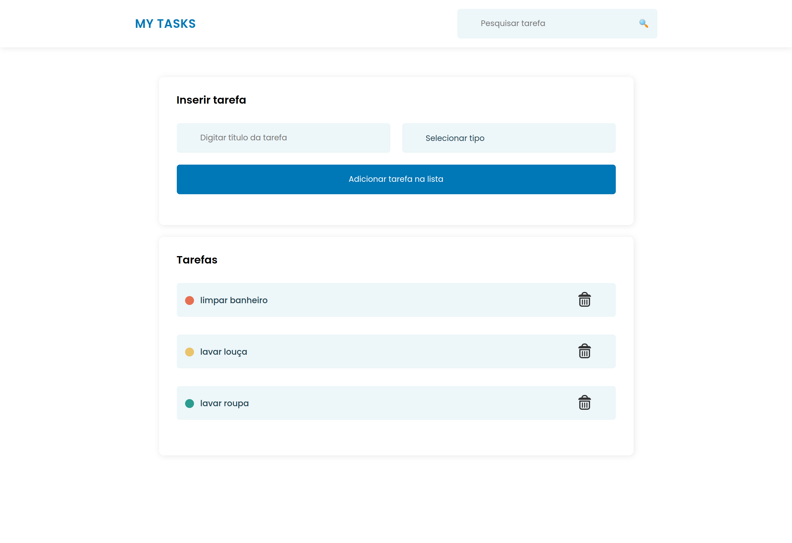

# To-do list
A to-do list website made with Semantic HTML, CSS Flexbox and Javascript DOM. Kenzie Academy Brazil provided this layout, but the code is 100% mine.

I was challenged to create the following functionalities: search, add and remove tasks to a task list.

### Final Result

### Desktop Version

## 🚀 Starting

To start the project, just click 
